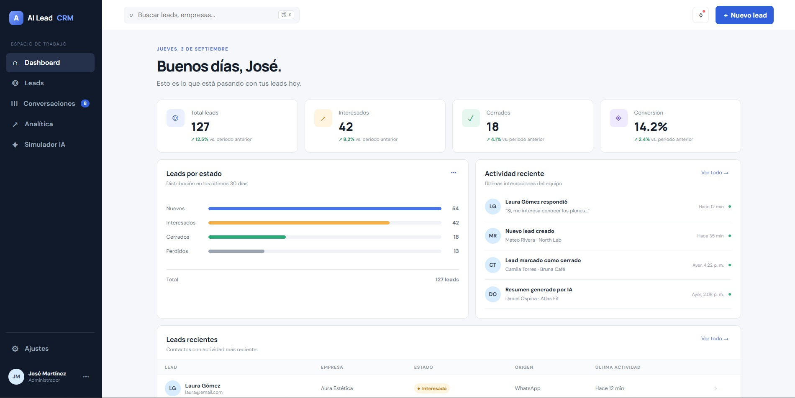

# AI Lead CRM

Primer vertical slice del CRM: cliente web, API y persistencia PostgreSQL.



## Requisitos

- Node.js 22+
- Docker con Docker Compose

## Inicio local

```bash
cp .env.example .env
docker compose up -d
npm install
npm run dev
```

El cliente queda en `http://localhost:5173` y la API en `http://localhost:3001`.

## API

`POST /api/leads`

```json
{
  "name": "Ada Lovelace",
  "email": "ada@example.com",
  "company": "Analytical Engines",
  "phone": "+57 300 123 4567",
  "source": "website"
}
```

`name` y `email` son obligatorios. La API devuelve `201` con el lead creado, `400` para datos inválidos y `409` si el correo ya existe.

## Probar la aplicación y llenar PostgreSQL

1. Crea el archivo local de configuración desde PowerShell:

   ```powershell
   Copy-Item .env.example .env
   ```

2. Inicia PostgreSQL y confirma que el contenedor esté saludable:

   ```powershell
   docker compose up -d
   docker compose ps
   ```

3. Instala las dependencias e inicia el cliente y la API:

   ```powershell
   npm install
   npm run dev
   ```

4. En otra terminal, crea leads reales mediante la API. Cada petición debe usar un email diferente:

   ```powershell
   $lead = @{
     name = "Laura Gómez"
     email = "laura@email.com"
     company = "Aura Estética"
     phone = "+57 300 123 4567"
     source = "whatsapp"
   } | ConvertTo-Json

   Invoke-RestMethod `
     -Uri "http://localhost:3001/api/leads" `
     -Method Post `
     -ContentType "application/json" `
     -Body $lead
   ```

5. Comprueba directamente los registros guardados:

   ```powershell
   docker compose exec postgres psql -U postgres -d ai_lead_crm -c "SELECT id, name, email, company, status, source, created_at FROM leads ORDER BY created_at DESC;"
   ```

También puedes abrir `http://localhost:3001/health` para comprobar que la API está activa. En este primer vertical slice, la creación persistente se prueba mediante `POST /api/leads`; los datos visibles del dashboard todavía son demostrativos y aún no se consultan desde PostgreSQL.

Para detener la aplicación usa `Ctrl+C`. La base de datos permanece en el volumen de Docker. `docker compose down` detiene PostgreSQL sin borrar los leads; `docker compose down -v` también elimina el volumen y todos sus datos.

## Comprobaciones

```bash
npm test
npm run typecheck
npm run build
```
